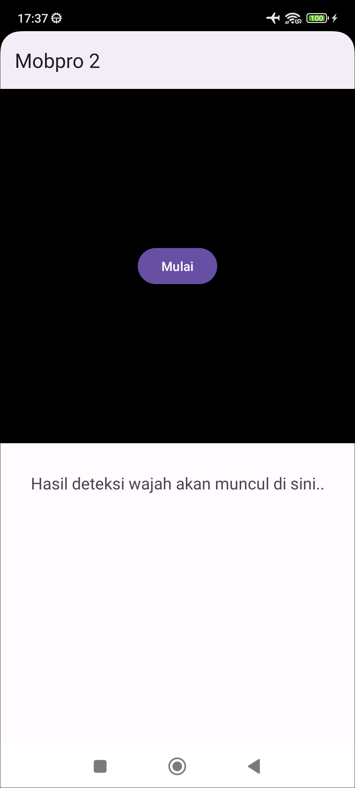
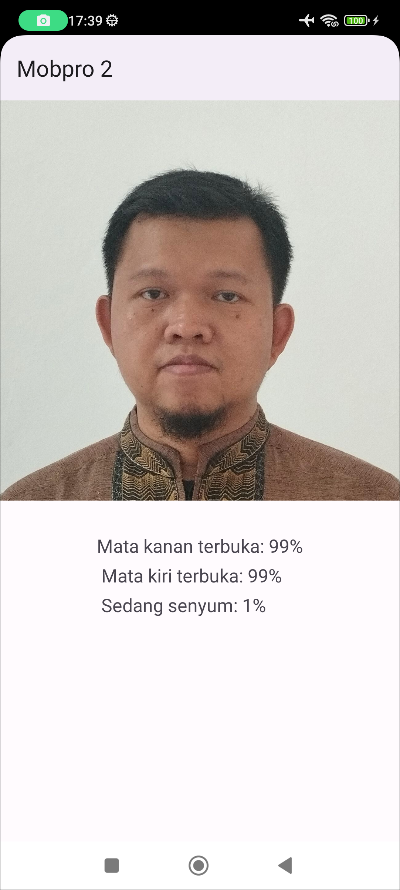

# Face Detector

Aplikasi Android yang menggunakan on-device machine learning untuk mendeteksi wajah pengguna. Gambar diambil menggunakan CameraX, sedangkan deteksi wajah menggunakan ML-Kit.

| Tampilan Awal                                | Tampilan Hasil                                |
|----------------------------------------------|-----------------------------------------------|
|  |  |

Punya pertanyaan atau masukan? Silahkan disampaikan melalui issue repository ini.

## Lisensi

    Copyright (c) 2023 Indra Azimi. All rights reserved.

    Dibuat untuk kelas Pemrograman untuk Perangkat Bergerak 2.
    Dilarang melakukan penggandaan dan atau komersialisasi,
    sebagian atau seluruh bagian, baik cetak maupun elektronik
    terhadap project ini tanpa izin pemilik hak cipta.