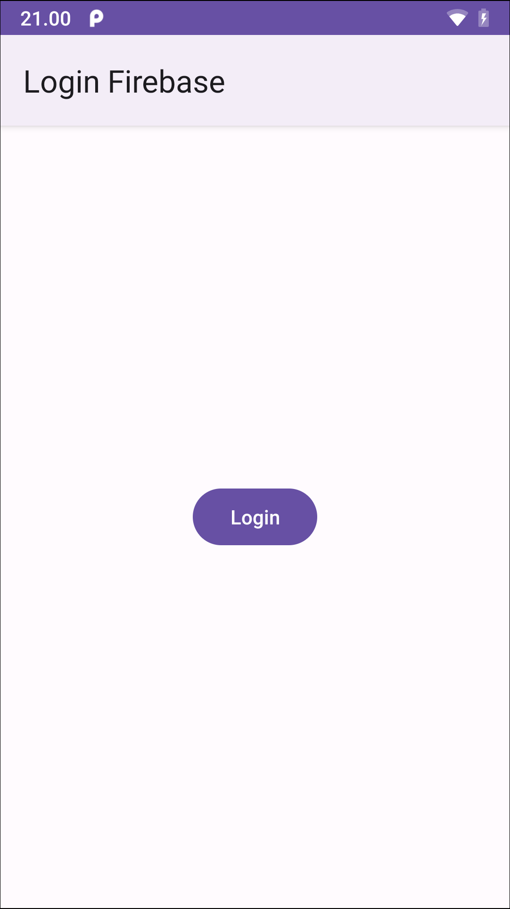
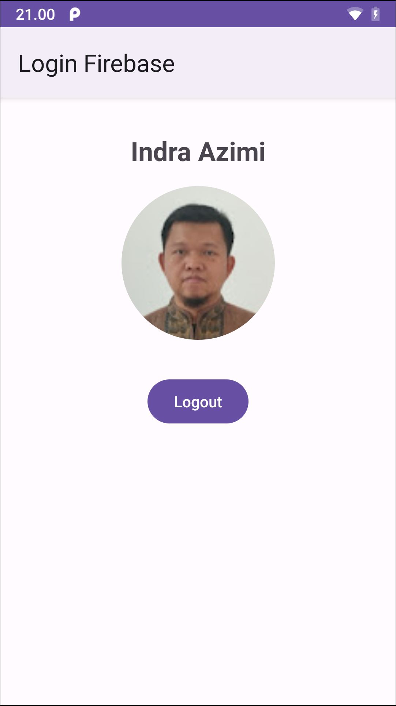

# Login Firebase

Aplikasi Android sederhana yang menggunakan FirebaseUI untuk fitur login dengan akun Google pengguna.

| Sebelum login                                        | Setelah login                                        |
|------------------------------------------------------|------------------------------------------------------|
|   |  |

Aplikasi ini menggunakan beberapa library lain, diantaranya:
- Glide, untuk mengambil foto profil pengguna dari server
- CircleImageView, untuk menampilkan foto profil pengguna

Punya pertanyaan atau masukan? Silahkan disampaikan melalui issue repository ini.

## Lisensi

    Copyright (c) 2020 Indra Azimi. All rights reserved.

    Dibuat untuk kelas Pemrograman untuk Perangkat Bergerak 2.
    Dilarang melakukan penggandaan dan atau komersialisasi,
    sebagian atau seluruh bagian, baik cetak maupun elektronik
    terhadap project ini tanpa izin pemilik hak cipta.